## demo project
#### what is this?
this is a guide (+ the code) to set up a simple Unreal Engine environment to access and edit the kinematic properties of a rigged mesh character directly through c++ code. The guide and the code are specifically tested on Windows 11, but some part might be used also for Linux and Mac, specifically the Unreal part. 
#### project structure.
the project include a tutorial specifically design for Unreal Engine 5 (that you can find [down here](#tutorial)). And two main folders with the code. The folder `demo_ik` include the full Unreal Engine 5.5.3 project, including the assets, you can use it as starting project for your work, or to verify that you didn't miss any step of the tutorial. Similarly, `demo_ik_ue4` include the same project but with few edits to be compatible with Unreal Engine 4, specifically the version 4.27.2.  Both the folder has the same structure, that follow the default structure of an Unreal engine project:
```
demo_ik
 ┣ .gitignore
 ┣ demo_ik.uproject
 ┣ Config
	┣ DefaultEditor.ini
	┣ DefaultEditorPerProjectUserSettings.ini
	┣ DefaultEngine.ini
	┣ DefaultGame.ini
	┗ DefaultInput.ini
 ┣ Content
	┣ Characters
	┣ LevelPrototyping
	┣ StarterContent
	┣ ThirdPerson
	┗ maps
 ┗ Source
	┣ demo_ik.Target.cs
	┣ demo_ikEditor.Target.cs
	┗ demo_ik
	   ┣ APosableCharacter.cpp
	   ┣ APosableCharacter.h
	   ┣ demo_ik.Build.cs
	   ┣ demo_ik.cpp
	   ┣ demo_ik.h
	   ┣ demo_ikCharacter.cpp
	   ┣ demo_ikCharacter.h
	   ┣ demo_ikGameMode.cpp
	   ┗ demo_ikGameMode.h
```
the file created in the tutorial are the two `APosableCharacter.h` and `APosableCharacter.cpp`, that you can find here:
```
demo_ik
 ┣ ...
 ┗ Source
	┣ ...
	┗ demo_ik
	   ┣ APosableCharacter.cpp
	   ┣ APosableCharacter.h
	   ┣ ...
```
#### how to use?
If you want to try to directly use the provided code, first install the desired unreal engine version and the visual studio editor (check [project setup](#project-setup) session in the tutorial). Then you can clone or download the project code in your computer. Place them in a desired folder, and you can directly run it from there. 
If you have any compilation problem, unreal will suggest to rebuild the project from source. To access the source code, open the project folder and right-click on `demo_ik.uproject` and click on `Generate Visual Studio project files`, if the option is not visible first click on `Show more options`. This will generate the visual studio solution file `demo_ik.sln`.


## tutorial

#### project setup
Install Epic Game launcher from Unreal website and the unreal version 5.5, if you don't have it already. Then, follow this tutorial to install and set up visual studio for Unreal Engine: [here](https://dev.epicgames.com/documentation/en-us/unreal-engine/setting-up-visual-studio-development-environment-for-cplusplus-projects-in-unreal-engine), this is the recommended choice for compatibility, but feel free to use any other code editor if you prefer.

once installed, launch the 5.5 version of Unreal from the Epic Games Launcher.

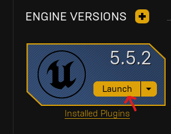

create a new game.select `Games` and then select the `third person template`, just to get the default Unreal's character skeletal mesh (note that `first person template` just load a model with the arms and hands only). Additionally under `project details` select `C++`, since we want to create our ik system through code and not in blueprints. Optionally include the `starter content` for additional assets.
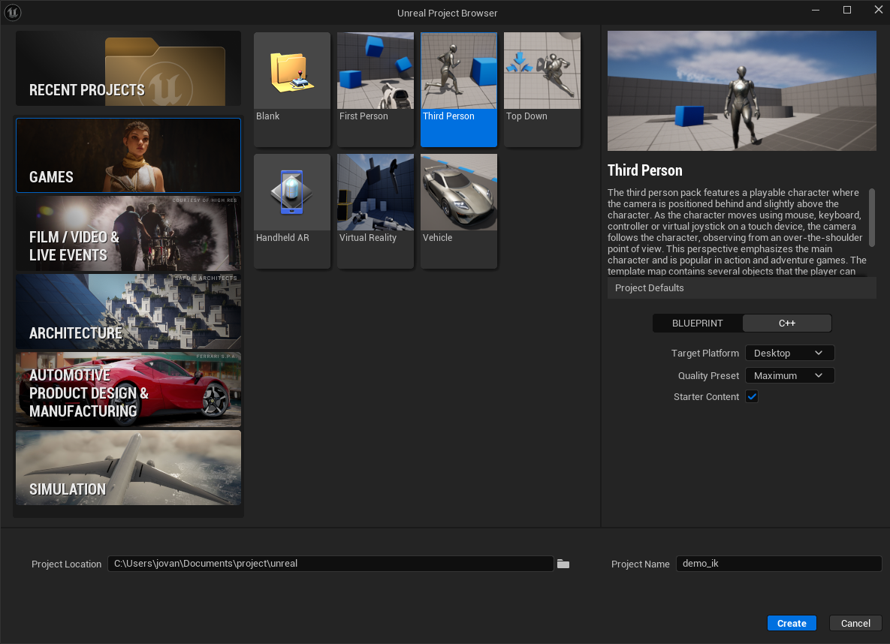
#### crete a c++ class:
once the project is created the editor automatically open. under `tools` select `new c++ class...`, this tool helps creating c++ class formatted for Unreal. 
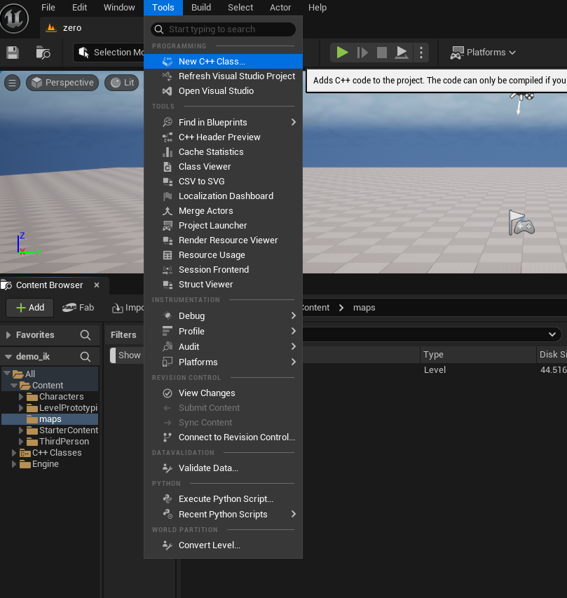
in our case we need to create an `actor` because we want the create a mesh that can be spawned and placed in the world.
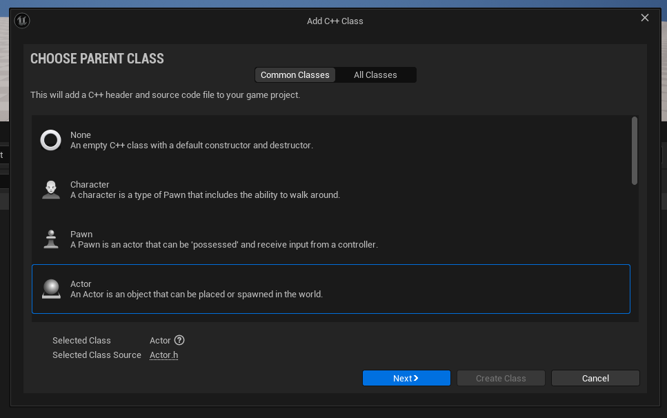
chose a name for your actor, in the example we set `APosableCharacter`, note that Unreal's naming convention guidelines suggest to call actor with the `A` prefix, this is not mandatory.
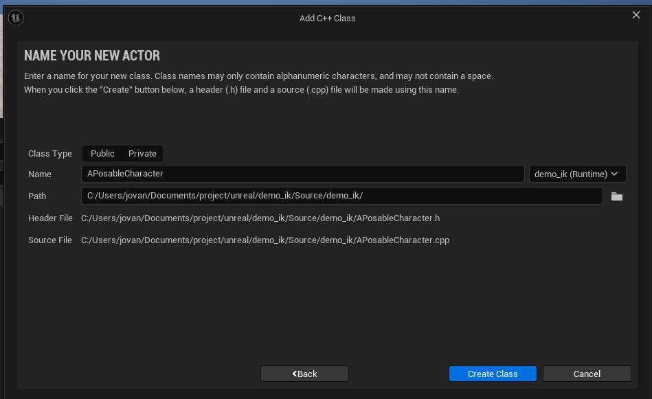
Note: a **posable mesh** in Unreal Engine is a specific mesh that can be edited directly through c++ code, without needing to pass by the animation system. We will use this to implement our IK code. Don't confuse it with the **skeletal mesh** which is the default class of mesh with a skeleton, and that can be animated through animation blueprints, but not in c++. We will use this skeletal mesh as input to create the posable one.
#### setting up a posable mesh:
The previous steps should create a default class derived from AActor base classes, organized as header (`.h`) and `.cpp` file. this class comes with a couple of predefined functions (constructor, beginPlay, tick).  So your `.h` file should look more or less like this:
```cpp
// Fill out your copyright notice in the Description page of Project Settings.

#pragma once

#include "CoreMinimal.h"
#include "GameFramework/Actor.h"
#include "APosableCharacter.generated.h"

UCLASS()
class DEMO_IK_API APosableCharacter : public AActor
{
	GENERATED_BODY()
	
public:    
	// Sets default values for this actor's properties
	APosableCharacter();

protected:
	// Called when the game starts or when spawned
	virtual void BeginPlay() override;

public:    
	// Called every frame
	virtual void Tick(float DeltaTime) override;

};
```
the first step is to get access to the posable mesh functionalities by include the necessary dependencies: `#include "Components/PoseableMeshComponent.h"`, note that you should always keep the `#include "<filename>.generated.h"` as last dependency of the list.  This allows us to declare a posable mesh component, here the declaration in the `.h` file:
```cpp
	UPROPERTY(VisibleDefaultsOnly, Category = Mesh)
	class UPoseableMeshComponent* posableMeshComponent_reference;
```
this can be defined either `public`, `protected` or eventually `private`, depends on the intended usage. 
Additionally we need to define a source skeletal mesh (this is the standard type of any skeleton-based character in Unreal). Practically this represent the character we want to use and edit with our posable mesh. So, still in the `.h` file we add this:
```cpp
public:
	UPROPERTY(EditAnywhere, Category = Mesh) 
	USkeletalMesh* default_skeletalMesh_reference;
```
ideally we want this to be `public` and with `UPROPERTY` set to `EditAnywhere`, so we can pick and select the character we want from the editor interface.

Let's now attach the posable mesh component to our actor (note that actor components are modular property that we can add to actors, and the posable mesh component is one of those). We do this using the predefined constructor. In your `.cpp` file, inside the constructor function you need to instantiate the posable mesh component using the `CreateDefaultSubobject` and then define the attachment to the actor, by either attach it to the actor `RootComponent` or by set the posable mesh component as `RootComponent`. Here an example:
```cpp
AAPosableCharacter::AAPosableCharacter()
{
	// Set this actor to call Tick() every frame.  You can turn this off to improve performance if you don't need it.
	PrimaryActorTick.bCanEverTick = true;
	
	posableMeshComponent_reference = CreateDefaultSubobject<UPoseableMeshComponent>(TEXT("PoseableMesh"));
	posableMeshComponent_reference->SetMobility(EComponentMobility::Movable);
	RootComponent = posableMeshComponent_reference;
}
```
Now, the only missing step is to initialize the posable mesh, using the given input skeletal mesh. To do so, we create a function, I called it `initializePosableMesh`, so that the declaration in the `.h` file would look like this:
```cpp
bool initializePosableMesh();
```
And the correspondent implementation in `.cpp` like this:
```cpp
bool AAPosableCharacter::initializePosableMesh()
{
	// initialization checks to avoid crashes.
	if (!posableMeshComponent_reference)
	{
		UE_LOG(LogTemp, Warning, TEXT("Posable mesh component not attached or registerd"));
		return false;
	}
	if (!default_skeletalMesh_reference)
	{
		UE_LOG(LogTemp, Warning, TEXT("No skeletal mesh reference provided."));
		return false;
	}

	// set up the poseable mesh component.
	posableMeshComponent_reference->SetSkinnedAssetAndUpdate(default_skeletalMesh_reference);
	return true;
}
```
Finally we need to call this function somewhere. In fact, while the constructor is automatically called at the generation of the scene, custom-function need to be called specifically. Therefore, we include this into the predefined `BeginPlay()` function in the `.cpp` file. Like this:
```cpp
// Called when the game starts or when spawned
void AAPosableCharacter::BeginPlay()
{
	Super::BeginPlay();
	initializePosableMesh();
}
```
The `BeginPlay()` function is called automatically by the engine when we play the game, this means that our initialization will take place only after, and so the mesh will be visible only in play mode. Of course, here we just show one possible approach, but, if you prefer, you can refer the source skeletal mesh directly in c++, and edit the code so it runs directly in the constructor. You will see an example in the provided source code.
#### adding our actor to the scene:
Now that the actor is defined in c++ we need to compile the code. Note that you need to compile the c++ code every time you modify something, to see the effect on the editor. There are different way to manage and compile `c++` code. Unreal offers a live compiling solution (without the need to reboot the system), you can find it in the bottom right of the editor interface:
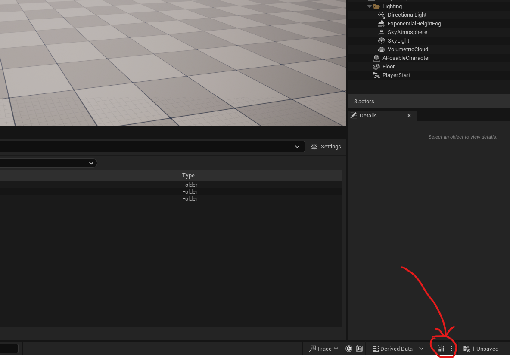
Once the code is compiled you will be able to find your actor in the content browser. If you don't, be sure that `Show C++ Classes ` is ticked in the component browser settings.
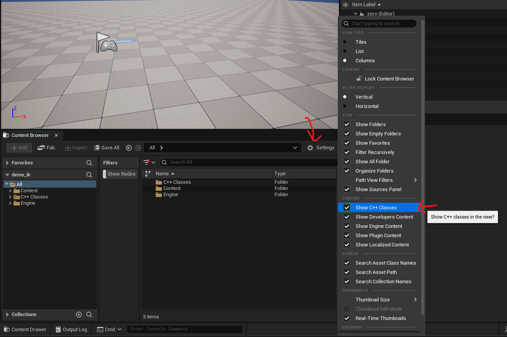
So now you can find all the `c++` files under `C++ Classes` folder. And if the compilation was successful you will be able to see our `APosableCharacter` file.
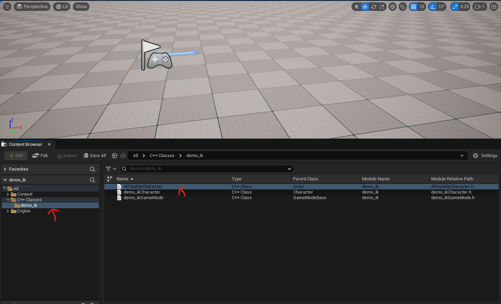
To include this in the scene, you just need to drag and drop the file in the scene. To check if it was correctly placed, you can check the scene hierarchy on the right. You should see the actor there. If it does not appear, it might be that you have some compilation problems.
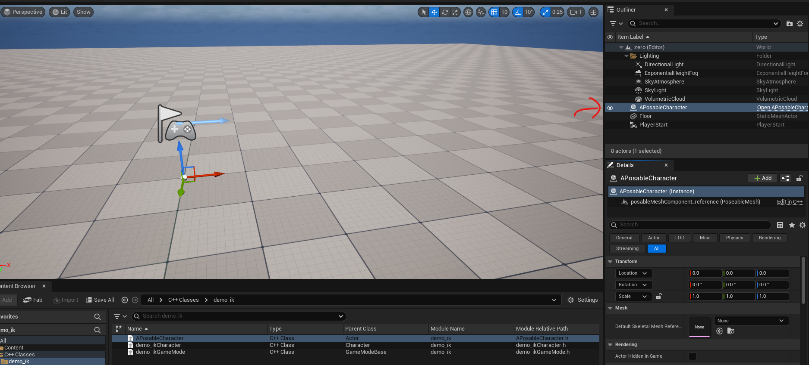
As you can see it is normal that nothing appear in the scene, because, as we saw before, our mesh is initialized only in play mode, and we haven't select the source mesh yet. In face if we press play now, we will just see the player of the Unreal default `Third person` character, that is not our posable mesh.
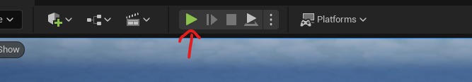
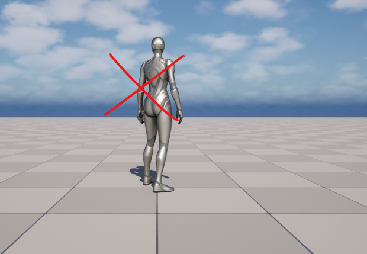
The only missing step is to select the mesh we want to use as input to generate our posable character. Given that we expose the variable using `UPROPERTY`, we are able to easily select our input mesh in the editor, by first selecting the `APosableCharacter` in the hierarchy and then by clicking on the `Details panel`, under the `Mesh` category the property `Default Skeletal Mesh Reference`. Unreal will automatically show us the compatible assets. (Note, do not edit this in game mode, otherwise the changes would not be saved). 
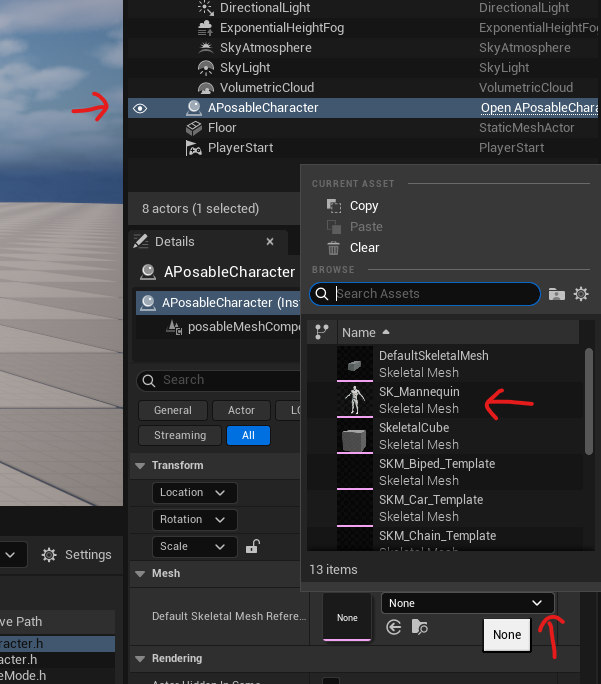
In this example I have selected the old UnrealEngine4 `SK_Mannequin` skeletal mesh, that, if you started with the `Third person` project you should find them following folder: `/Game/Characters/Mannequin_UE4/Meshes`. But you can use any skeletal mesh you like (try to load the new UE5 mannequin male or female). Once selected if we press play again, we should be able to see our posable mesh character in the default A-pose, next to the third person player.
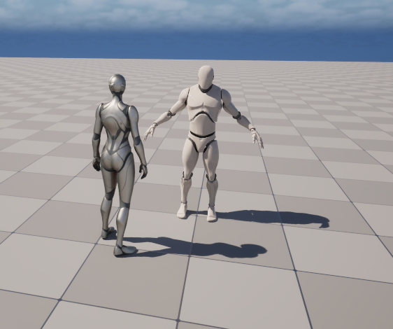
If you don't want to see the third person player every time you play the scene, you should edit the game mode. Or you can press `simulate` instead of play.
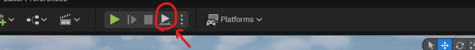
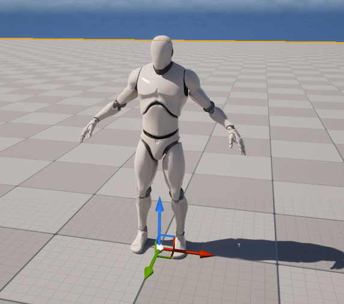
#### access and edit posable mesh bones in c++:
Now our system is properly working, and we can set up the code to edit and access each individual bone in the hierarchy. In fact, the posable mesh component allows to access and modify bones properties in the main thread (`BeginPlay` and `Tick` functions). We can easily find the functions templates in the documentation or by directly looking at class and parents'classes definitions, here for example, some relevant function declared in `PoseableMeshComponent.h`:
```cpp
[...]
	UFUNCTION(BlueprintCallable, Category="Components|PoseableMesh")
	ENGINE_API void SetBoneTransformByName(FName BoneName, const FTransform& InTransform, EBoneSpaces::Type BoneSpace);

	UFUNCTION(BlueprintCallable, Category="Components|PoseableMesh")
	ENGINE_API void SetBoneLocationByName(FName BoneName, FVector InLocation, EBoneSpaces::Type BoneSpace);

	UFUNCTION(BlueprintCallable, Category="Components|PoseableMesh")
	ENGINE_API void SetBoneRotationByName(FName BoneName, FRotator InRotation, EBoneSpaces::Type BoneSpace);

	UFUNCTION(BlueprintCallable, Category="Components|PoseableMesh")
	ENGINE_API void SetBoneScaleByName(FName BoneName, FVector InScale3D, EBoneSpaces::Type BoneSpace);

	UFUNCTION(BlueprintCallable, Category="Components|PoseableMesh") 
	ENGINE_API FTransform GetBoneTransformByName(FName BoneName, EBoneSpaces::Type BoneSpace);

	UFUNCTION(BlueprintCallable, Category="Components|PoseableMesh")
	ENGINE_API FVector GetBoneLocationByName(FName BoneName, EBoneSpaces::Type BoneSpace);

	UFUNCTION(BlueprintCallable, Category="Components|PoseableMesh")
	ENGINE_API FRotator GetBoneRotationByName(FName BoneName, EBoneSpaces::Type BoneSpace);

	UFUNCTION(BlueprintCallable, Category="Components|PoseableMesh")
	ENGINE_API FVector GetBoneScaleByName(FName BoneName, EBoneSpaces::Type BoneSpace);

	UFUNCTION(BlueprintCallable, Category="Components|PoseableMesh")
	ENGINE_API void ResetBoneTransformByName(FName BoneName);

	UFUNCTION(BlueprintCallable, Category="Components|PoseableMesh")
	ENGINE_API void CopyPoseFromSkeletalComponent(USkeletalMeshComponent* InComponentToCopy);
[...]
```
As mentioned above, in order to modify one bone we need two elements: the name of the bone (or eventually the index), and the desired modification we want to apply (either on location, rotation, scale, or directly the full transform).  
One simple way to get the bones names, is to look directly at the skeletal mesh asset we are using. To open the asset select it in the `Content Browser`
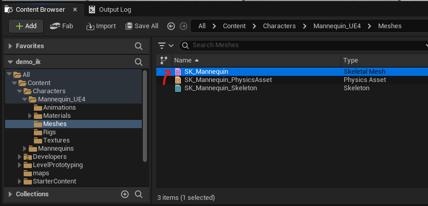
or directly from the `Details` windows of your posable actor.
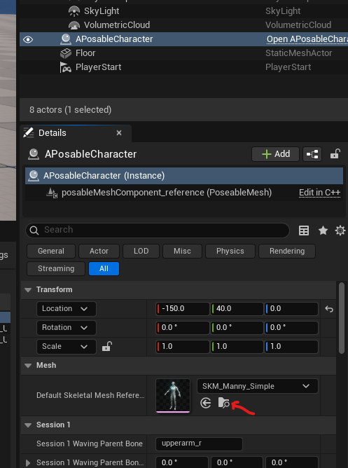
Once opened, you should see the following interface. This shows: in the center the view of the skeletal mesh you selected (in this example, I have opened the new Mannequin), and on the right the skeleton hierarchy. This last one shows us the parent-child dependencies of each bone, and the accessing name. 
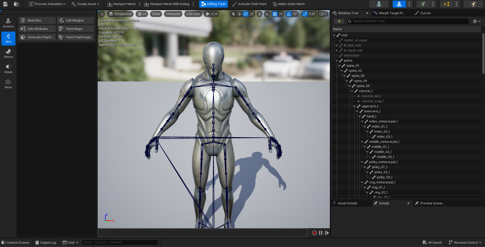
In this editor interface you can test and manually rotate some of the bones and see how the modification affects the skeleton (don't worry about playing around the change should not affect the skeleton default pose, just be careful of not using the skeleton or mesh editing tools you see on your right). To modify a bone you can simply select it in the hierarchy, see (1) in the following figure, then select the rotating tool on top (2), manually rotate the desired axis, in this case the `y` one, you can also edit values by hand in the `Details` session on the right (4) or either reset to the original pre-modification pose (4). 
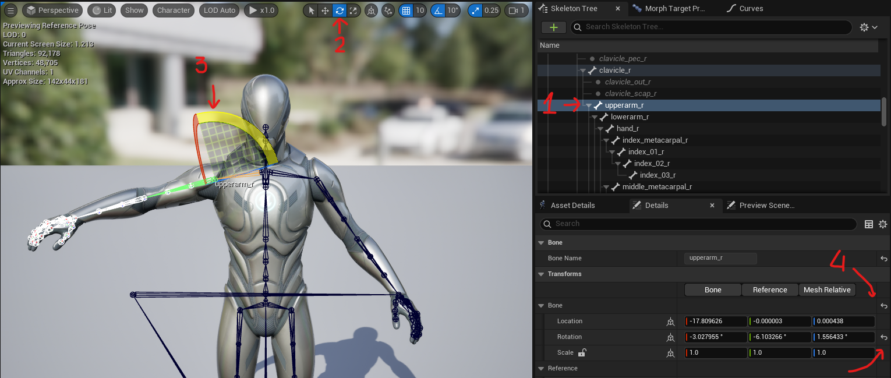
Be aware that,  by default, the bones are not visible on the mesh, to activate the visualization click on `Character` &rarr; `Bones` &rarr; `All Hierarchy`. Other settings are available.
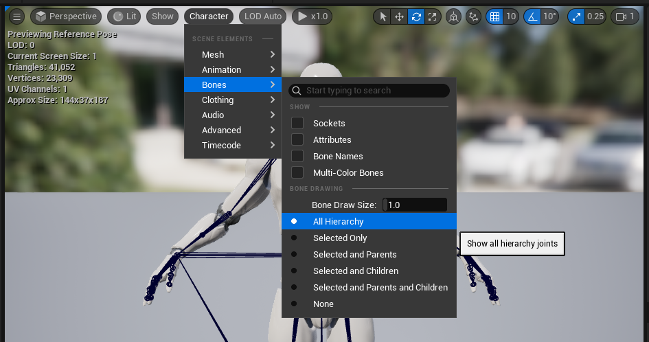
As you can notice, if we rotate the shoulder (`upperarm_r` bone), all the bones belonging to the same kinematic chain rotate accordingly. This might seems intuitively, but it requires some background computation, in fact Unreal (like most of the editors) implements **Forward Kinematics (FK)**, to propagate rotation to children bones, and maintain the kinematic connections of the bones. We will use this property also in our code. It is important to notice that most skeletal meshes often have a lot of auxiliary bones, like the one including the `twist` keywords, these kind of bones should **not** be rotate manually, because their behavior is not always linked to a joint rotation, but instead they serve other functionalities like avoiding mesh artifacts, so we will not consider them in our examples. As well as sockets and other elements that you can find in the hierarchy's list.

In synthesis: we can apply local and global rotation in our `c++` code to our posable mesh. Remember that, in our example, modifications on the starting pose should be performed in the `BeginPlay` function, while the logic for run-time editing of bones should go into the `Tick` function. This is a simplified approach and it is not always like this especially for more complex game logics, but it serves our purpose.


Let's see a simple example (waving motion :wave:)
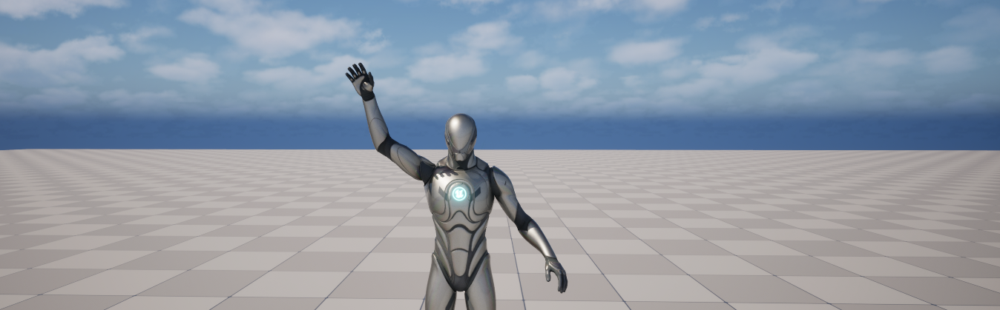
First, let's place our character on this waving pose. Starting by finding the appropriate rotation values for the shoulder and the elbow. One way to achieve that is to use the skeleton mesh editor we saw before, and keep track of the applied rotations. 
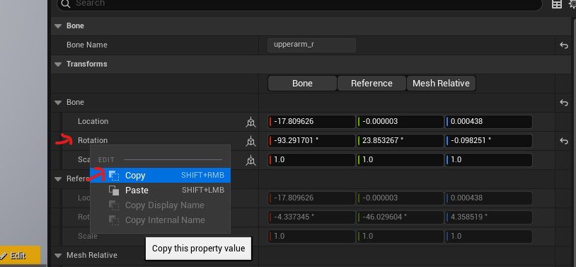
We can easily copy values from the editor, here you should be careful about two things: (1) in what space the rotation is expressed, in fact by default values are expressed in local reference system, but this can be changed to global by clicking on the reference system icon (see the figure down below, on the left the local reference system, and on the right the global one).
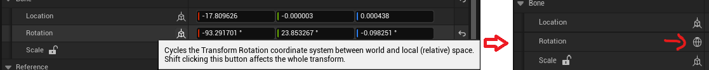
(2) Secondly, you should be aware that the editor display rotation as euler angles, more specifically: yaw, pitch, and roll. When we copy the values from the editor we obtain this kind of string: `(Pitch = 21.435965, Yaw = 21.709806, Roll = -92.235083)` we the values you copied. Noticed that the order of the rotation follow the convention used by Unreal. 
In our example we will use rotations taken from the editor to set our pose (be sure you are using the same mesh that you use in your posable mesh, in fact these rotations values are strictly related to the skelton mesh, and they might vary on different meshes due to different configuration, starting pose, etc...). So we will use it in this way in `c++`:
```cpp
FRotator relativeBoneRotation = FRotator(21.435965, 21.709806, -92.235083);
```
In this way we create a `FRotator` type which is one of the Unreal representation for rotations (I attach here the definition you can find inside the rotator header file `Rotator.h`, this can be useful to understand how things works).
```cpp
/**
 * Implements a container for rotation information.
 *
 * All rotation values are stored in degrees.
 *
 * The angles are interpreted as intrinsic rotations applied in the order Yaw, then Pitch, then Roll. I.e., an object would be rotated
 * first by the specified yaw around its up axis (with positive angles interpreted as clockwise when viewed from above, along -Z), 
 * then pitched around its (new) right axis (with positive angles interpreted as 'nose up', i.e. clockwise when viewed along +Y), 
 * and then finally rolled around its (final) forward axis (with positive angles interpreted as clockwise rotations when viewed along +X).
 *
 * Note that these conventions differ from quaternion axis/angle. UE Quat always considers a positive angle to be a left-handed rotation, 
 * whereas Rotator treats yaw as left-handed but pitch and roll as right-handed.
 * 
 */
```
Once we define the relative rotation, we need to find a way to set this rotation into the posable mesh. Unfortunately, posable mesh accepts values only in `ComponentSpace`, relative to the actor component reference system, and `WorldSpace`, relative to the world reference system. For this reason, setting up the local rotation requires a few steps.
```cpp
// (1) define the bone name.
boneName = FName("copy_here_the_bone_name");

// (2) get the bone transform in component space.
FTransform bone_componentSpaceTransform = posableMeshComponent_reference->GetBoneTransformByName(
	boneName,
	EBoneSpaces::ComponentSpace
);

// (3) get the bone's parent transform in component space.
FTransform parent_componentSpaceTransform = posableMeshComponent_reference->GetBoneTransformByName(
	posableMeshComponent_reference->GetParentBone(boneName),
	EBoneSpaces::ComponentSpace
);

// (4) extract the bone transform relative to the parent reference system (using FTransform built in function). 
FTransform bone_relativeTransform = bone_componentSpaceTransform.GetRelativeTransform(parent_componentSpaceTransform);

// (5) define the relative rotation we want to set.
FRotator relativeBoneRotation = FRotator(21.435965, 21.709806, -92.235083);

// (6) set the rotation in the relative transform. (note that transform use quaternions internally, so we need to use the built in function to extract the quaternion from the Rotator).
bone_relativeTransform.SetRotation(relativeBoneRotation.Quaternion());

// (7) change back from relative space to component space. 
bone_componentSpaceTransform = bone_relativeTransform * parent_componentSpaceTransform;

// (8) finally we set the rotation, in component space, by name.
posableMeshComponent_reference->SetBoneRotationByName(
	boneName,
	bone_componentSpaceTransform.Rotator(),
	EBoneSpaces::ComponentSpace
);
```
In the shared code, these steps are used to define two bones local rotations, respectively `clavicle_r` and `upperarm_r`, and we include this in a function, that we call inside `BeginPlay`. With this function we are able to define the starting pose of our waving example.
**remember to compile every time you edit the code.**

#### animate bones in real time:
In this last part of the tutorial we will animate the mannequin lower arm. We use a simple periodic function:
```cpp
FMath::Sin(x)
```
We relate this function with the passing time, setting also the angle amplitude and the velocity of the movement. This process is pretty straightforward. Compare to the previous example, we would need to store the values of the transform of the starting pose, so that we can use it as zero-point of the oscillation. This is also performed in the `BeginPlay`. The rest of the code is exactly the same as before, but executed per-frame in the `Tick` function wrapped by the periodic `sin` function.
